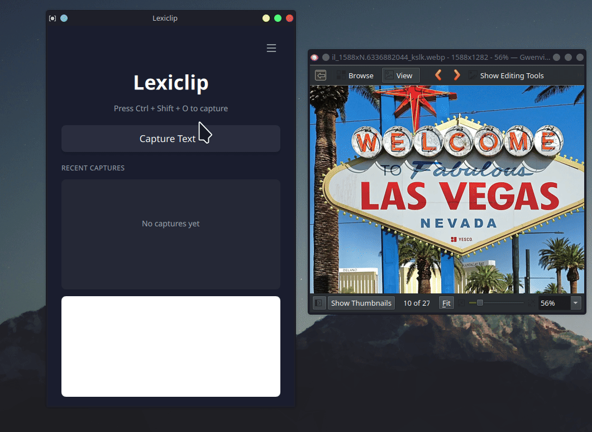

# Lexiclip OCR

[](https://opensource.org/licenses/MIT)
[](https://github.com/Deskwise/lexiclip)
[](https://www.python.org/downloads/)

> **Capture text from anywhere on your screen with a simple hotkey**

## Demo



*Press Ctrl+Shift+O to select any text on your screen - it's instantly copied to your clipboard!*


A cross-platform OCR tool that captures text from your screen and copies it to your clipboard.

## Features
- **Cross-Platform**: Runs on Linux, Windows, and macOS (in progress).
- **Instant OCR**: Select a region on your screen to capture text.
- **Clipboard Integration**: Captured text is automatically copied to your clipboard.
- **History**: Keeps a history of captured text.
- **Smart Formatting**: Preserves paragraphs or joins lines based on context.

## Installation

### Prerequisites
- Python 3.10+
- Tesseract OCR (must be installed on the system)
    - **Linux**: `sudo apt install tesseract-ocr libtesseract-dev`
    - **Windows**: Download and install from [UB-Mannheim/tesseract](https://github.com/UB-Mannheim/tesseract/wiki)

### Running from Source

1. Clone the repository:
   ```bash
   git clone https://github.com/yourusername/lexiclip.git
   cd lexiclip
   ```

2. Create a virtual environment:
   ```bash
   python -m venv venv
   source venv/bin/activate  # Linux/macOS
   # or
   .\venv\Scripts\activate   # Windows
   ```

3. Install dependencies:
   ```bash
   pip install -r requirements.txt
   ```

4. Run the application:
   ```bash
   python main.py
   ```

## Building for Distribution

We use PyInstaller to create standalone executables.

### Windows Build

1. Ensure you are in the virtual environment and dependencies are installed.
2. Install PyInstaller:
   ```bash
   pip install pyinstaller
   ```
3. Run the build command:
   ```bash
   pyinstaller PlasmaOCR.spec
   ```
4. The executable will be in the `dist/` folder.

### Linux Build

1. Install PyInstaller:
   ```bash
   pip install pyinstaller
   ```
2. Run the build command:
   ```bash
   pyinstaller PlasmaOCR.spec
   ```
3. The executable will be in the `dist/` folder.

### macOS Build

1. Install Tesseract:
   ```bash
   brew install tesseract
   ```
2. Install PyInstaller:
   ```bash
   pip install pyinstaller
   ```
3. Run the build command:
   ```bash
   pyinstaller PlasmaOCR.spec
   ```
4. The `.app` bundle will be in the `dist/` folder.

> **Note on Permissions**: On first run, macOS will prompt for **Screen Recording** and **Accessibility** permissions. You must grant these for the app to function.
>
> **Note on Distribution**: To distribute to other users, you must sign and notarize the `.app` bundle using an Apple Developer ID, otherwise they will see "Unidentified Developer" warnings.

### AppImage Build (Universal Linux)

To build an AppImage that runs on most Linux distributions (Fedora, Arch, Debian, etc.):

1. Ensure `appimagetool` dependencies (like `wget` and `file`) are installed.
2. Run the build script:
   ```bash
   ./build_appimage.sh
   ```
3. The result will be `LexiclipOCR-x86_64.AppImage`.

### Docker Build (Recommended for Linux)

To ensure maximum compatibility across different Linux versions, it is best to build inside a container (Ubuntu 20.04 base).

1. Build the Docker image:
   ```bash
   docker build -t lexiclip-builder .
   ```
2. Run the container to generate the AppImage:
   ```bash
   docker run --rm -v $(pwd):/app lexiclip-builder
   ```
   *Note: This mounts your current directory to `/app` so the output file is saved to your host machine.*

## Configuration
- **Autostart**: Can be enabled in the settings menu.
- **Hotkeys**: Default is `Ctrl+Shift+O`. Customizable in settings.
